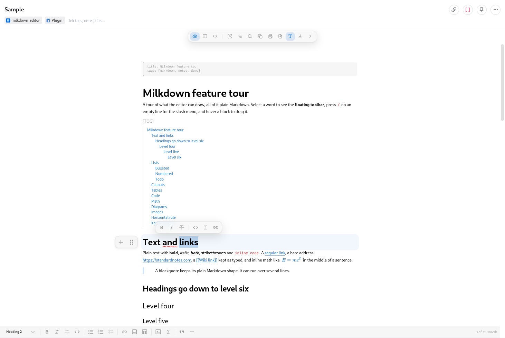
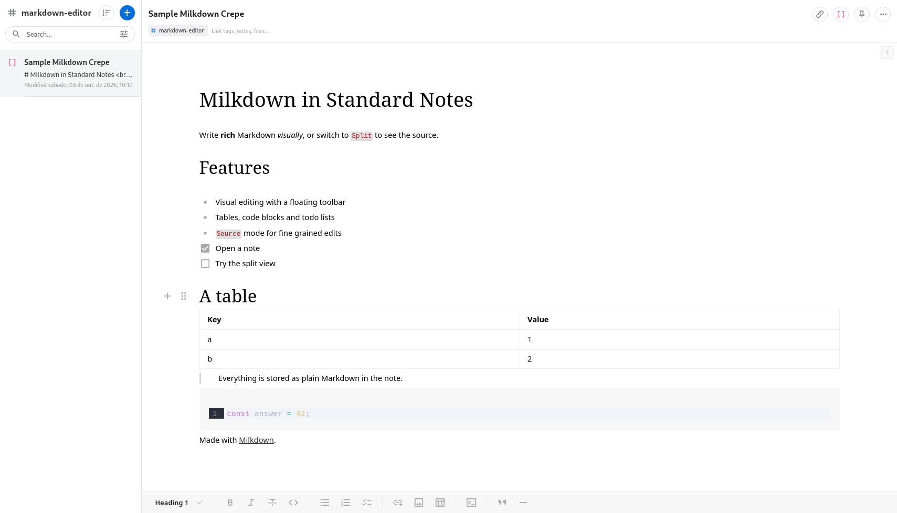
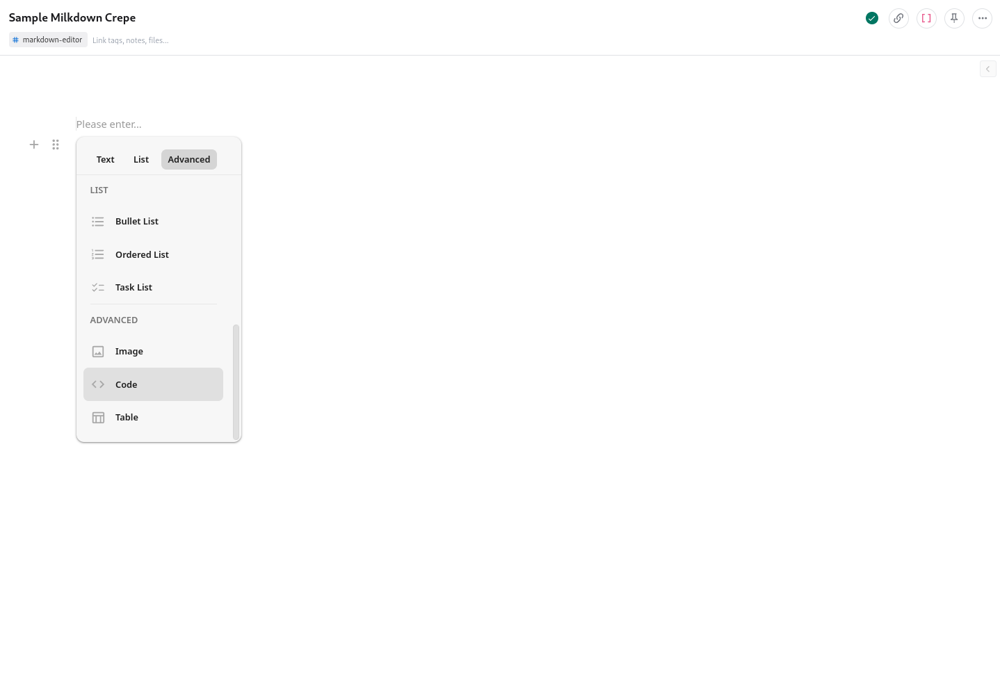

# StandardNotes Milkdown

[](https://github.com/Esl1h/StandardNotes-Milkdown/actions/workflows/ci.yml)
[](https://github.com/Esl1h/StandardNotes-Milkdown/releases/latest)
[](LICENSE)

A WYSIWYG Markdown editor for [Standard Notes](https://standardnotes.com), a
free, open-source, end-to-end encrypted notes app, powered by
[Milkdown Crepe](https://milkdown.dev). Notes stay plain Markdown inside the
note, so they remain readable, searchable, exportable and portable; the
plugin only changes how you edit them.



## Features

1. Visual editing of the whole Markdown feature set without seeing the
   source: headings, lists, todo lists, tables, links, images, blockquotes
   and code blocks with syntax highlighting
2. A floating toolbar on the selection, a `/` slash menu and drag handles
   to add and move blocks
3. Math with KaTeX: `$inline$` formulas and `$$` blocks
4. Diagrams: ```` ```mermaid ```` code blocks show a live preview of the diagram, while the note keeps its source; the diagrams follow a change of the app theme without reopening the note
5. Images uploaded, pasted or dropped are embedded in the note; large ones
   are scaled down so the note stays light
6. Three modes, switched from the icon bar at the top: **Visual**,
   **Split** (the Markdown source next to the visual editor, side by side
   or stacked) and **Source** (a plain CodeMirror pane for fine grained
   edits)
7. An optional fixed formatting bar, at the top or the bottom of the editor, with a word count and the reading time at its right end (`132 words · 1 min`, or `12 of 132 words` while text is selected)
8. **Copy as Markdown**, **Print** and **Export as HTML** buttons in the icon bar; printing shows only the rendered note, and the export saves it as a page of its own (light or dark by the system, named after the first heading; the front matter is left out and a diagram is saved as its code). Below 520 px of width these actions, and the formatting bar settings, move into a `...` menu
9. Find and replace (`Ctrl/Cmd+F` or the search button), with highlighted
   matches and a `2/7` count; source mode uses CodeMirror's own search
10. An outline of the note's headings in a side panel, to jump around long notes; headings inside quotes and lists are listed too
11. The icon bar itself folds away with the `>` button at its right end,
    leaving only a small `<` in the corner to bring it back. Layout choices
    are saved with the editor in your Standard Notes account
12. Opening a note never rewrites it: nothing is saved until you edit
13. Undo never reaches into the previously opened note
14. Works with the Standard Notes web, desktop and mobile apps; follows
    the theme selected in the app. On narrow screens the split view stacks
15. A new empty note shows an `Add sample` button that seeds it with
    example Markdown
16. If the editor ever fails to render, the raw note text stays available
    and editable in a plain text area, and edits are still saved

## Screenshots

The icon bar folded away and the formatting bar at the bottom, leaving
only the note:



The `/` slash menu on a new note, for adding lists, images, code blocks
and tables:



## Installation

1. Run the Standard Notes web or desktop app.
2. Click the **Preferences** (gear) icon.
3. Select **Plugins** in the Preferences menu.
4. Scroll to the bottom and paste this URL into the
   **Install Custom Plugin** box:

   ```
   https://esli.cafe/StandardNotes-Milkdown/ext.json
   ```

5. Confirm the installation.
6. Create a new note, open the **Editor** menu and pick **Milkdown**.

The app checks that URL for updates, so new releases arrive on their own.
Each [release](https://github.com/Esl1h/StandardNotes-Milkdown/releases/latest)
also carries the packaged build as `extension.zip`.

## Note format

The note body is plain Markdown: CommonMark plus GitHub Flavored Markdown
(tables, task lists, strikethrough).

````markdown
# Shopping

- [x] bread
- [ ] coffee

| Item  | Price |
| ----- | ----- |
| bread | 2.50  |

> Everything stays in the note as plain text.

Energy: $E = mc^2$


````

- Nothing is stored outside the note: open the same note with the built in
  editor and the content is identical
- Opening a note never changes it. The first edit rewrites the whole note in the shape the visual editor writes. What changes:
  - `*` list markers become `-`
  - reference links become inline links and the `[1]: url` definition goes away
  - a line break made of two trailing spaces becomes a backslash
  - setext headings (`Title` over `=====`) become `# Title`
  - tables are padded with spaces and their alignment row is rewritten
  - a stray `*` is escaped (`5\*3`) and a bare URL gets angle brackets (`<https://...>`)
  - block HTML gets a blank line before its closing tag
- Footnotes, inline HTML, ordered lists that start at a number other than 1, inline math, `__bold__` and `_italic_`, front matter, wiki links and the `[TOC]` line are kept as written
- Images are either links (``), loaded from their host,
  or embedded as data URIs when uploaded, pasted or dropped. Embedded
  images up to 500 KB go in as they are; larger ones are scaled down and
  recompressed, since the note syncs to every device
- Images keep their alt text and title when the note is edited. One limit: Crepe stores the resize ratio of an image in its alt text, so resizing an image that has alt text replaces the alt with the ratio (for example ``)
- YAML front matter (between `---` fences), TOML front matter (between `+++` fences), GitHub alerts (`> [!NOTE]`, rendered as colored callouts) and `[[wiki links]]` are kept exactly as written, so notes imported from GitHub, Obsidian, Jekyll or Hugo are not rewritten
- A line that says only `[TOC]` is a table of contents: add it from the `/` menu (**Table of contents**) and the editor draws a live list of the headings under it, each one a link. The note keeps just the `[TOC]` line, which Typora, GitLab and other Markdown tools read the same way
- Math uses the `$...$` / `$$...$$` syntax and diagrams the ```` ```mermaid ````
  fence, both understood by GitHub, Obsidian and most Markdown tools

## Privacy

Everything is stored inside your Standard Notes note, so it is encrypted
with the rest of your data. The editor has no AI features and no network
access of its own; the only remote content it loads is images linked by
URL in the note. Mermaid renders diagrams with its strict security level.

## Development and running locally

**Prerequisites:**

1. (Optional) Fork this repo on GitHub.
2. [Clone](https://docs.github.com/en/repositories/creating-and-managing-repositories/cloning-a-repository)
   this repo or your fork.
3. Run `cd StandardNotes-Milkdown` and then `npm install` to install all
   dependencies.

### Testing inside your local Standard Notes app

The editor waits for Standard Notes to send the note, so it needs a host:
the Standard Notes app, or the fake host of the e2e suite.

1. Run `npm run build` to build the app, then:

```
npm run server-cors
```

2. In Standard Notes, follow the Installation steps above but paste:

```
http://localhost:3000/ext.dev.json
```

The dev extension uses a separate identifier (`Milkdown (Dev)`) so it does
not clash with the hosted one.

3. When you're done, press `Ctrl + C` to shut down the server.

If you run into issues, please refer to the
[Standard Notes instructions for local plugin setup](https://standardnotes.com/help/plugins/local-setup).

### Checks

CI runs these on every push and pull request; run them before opening a PR:

```
npm run typecheck   # TypeScript
npm run lint        # ESLint
npm test            # unit tests (Vitest)
npm run build       # production build
npm run e2e         # end to end tests (Playwright)
```

Run `npx playwright install chromium` once before the first `npm run e2e`.
The e2e suite builds the plugin and drives it through a fake Standard Notes
host (`e2e/snHost.js`), including a throttled CPU (slow mobile WebView) and
the opaque origin of the mobile app.

Only the Crepe features in use are bundled (no AI): the main chunk is
about 390 KB gzipped. KaTeX (about 80 KB gzipped) loads in its own chunk
at startup, Mermaid only when a note has a diagram, and code block
languages on demand.

### Deployment

The extension is hosted on GitHub Pages from the `gh-pages` branch, served
at `https://esli.cafe/StandardNotes-Milkdown/`. Releases are automated by
the `Release` workflow:

1. Bump the version in `package.json` and `public/ext.json` (also its
   `download_url`) in one `chore(release)` commit. The workflow rewrites
   the version on the distributed `ext.json` (zip + Pages), so the app
   updates automatically by comparing the version at `latest_url`; keeping
   the committed copy in sync avoids a misleading one.
2. On `main`, push a tag whose version matches `package.json` (the
   workflow fails otherwise):

```
git tag -a vX.Y.Z -m vX.Y.Z && git push origin vX.Y.Z
```

The workflow builds, runs the checks, attaches `extension.zip` to the
GitHub release and publishes the hosted build to Pages.

## Credits and license

- Built on [Standard Notes](https://standardnotes.com),
  [@standardnotes/editor-kit](https://github.com/standardnotes/editor-kit)
  and [Milkdown](https://milkdown.dev) (MIT)
- Licensed under [AGPL-3.0](LICENSE) or later
